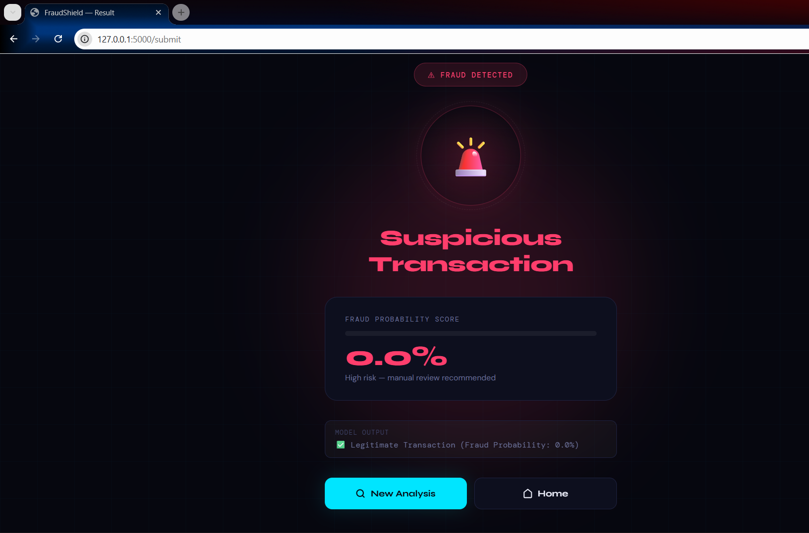

# 💳 Online Payments Fraud Detection using Machine Learning

## 📌 Overview
This project detects fraudulent online payment transactions using a Random Forest classifier integrated with a Flask web application.

---

## 🚀 Features
- Data preprocessing
- Imbalanced dataset handling
- Random Forest classification
- Fraud probability threshold tuning
- Flask web interface for prediction

---

## 🛠️ Technologies Used
- Python
- Pandas
- NumPy
- Scikit-learn
- Flask
- HTML

---

## 📊 Model Performance
Model Accuracy: ~99%

---

## 🖥️ Application Screenshots




=======

>>>>>>> 97f7644 (Updated project documentation)

---

## ▶️ How to Run

```bash
pip install -r requirements.txt
cd flask
python app.py
